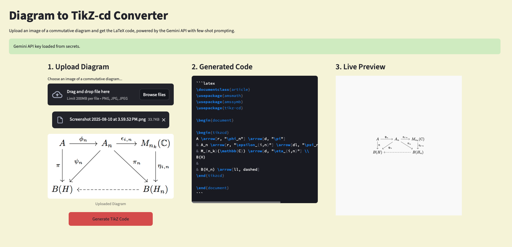

# **Diagram to TikZ-cd Converter**

This Streamlit web application converts an image of a commutative diagram into its corresponding **LaTeX code**. The application uses a sophisticated pipeline that combines a multi-modal large language model (LLM) with **few-shot prompting** to accurately interpret diagrams and generate precise code.

## **✨ Features**

* **Multi-modal AI:** Uses the **Gemini API** to understand both the visual layout of the diagram and the text within the image.  
* **Few-Shot Prompting:** Provides the model with a few high-quality examples to establish a consistent and accurate output format.  
* **Optical Character Recognition (OCR):** Employs **pytesseract** and **OpenCV** to extract text labels from the diagram image, which is a critical step for the RAG search.  
* **Streamlit GUI:** A user-friendly web interface for uploading images and viewing the generated code.

## **🚀 Prerequisites**

To run the application, you need:

* **Python 3.8+**  
* A **Gemini API Key** from Google AI Studio.  
* The official **tikz-cd documentation** PDF.  
* The **Tesseract OCR engine** installed on your operating system.

## **📦 Setup & Installation**

1. **Clone the repository and install dependencies:**  
   git clone \<your-repo-url\>  
   cd \<your-repo-name\>  
   pip install \-r requirements.txt

   (You'll need a requirements.txt file with: streamlit, google-generativeai, opencv-python, pytesseract, Pillow.)  
2. Configure your environment:  
   Create a .streamlit/secrets.toml file with your Gemini API key:  
   \[secrets\]  
   GEMINI\_API\_KEY \= "YOUR\_API\_KEY\_HERE"

3. Add project files:  
   Create a docs/ folder for tikz-cd-doc.pdf and an examples/ folder for the few-shot files (.png and .txt files for fiber\_product, snake, and cube).

## **💻 How to Use**

1. Run the app:  
   You can try the live version here: https://atrbyg24-tikzcd-ai-app-rrzfzq.streamlit.app/  
   To run it locally, use:  
   streamlit run your\_main\_script\_name.py

2. Use the web interface:  
   Upload an image, click "Generate TikZ Code," and the application will display the LaTeX code.

## **📁 Project Structure**

your-project-name/  
├── .streamlit/  
├── docs/  
├── examples/  
├── requirements.txt 
├── packages.txt  
├── style.css    
└── app.py

## **To-do**

* ~~In-app Latex rendering~~
* Dynamically scale live preview
* Manually edit code
